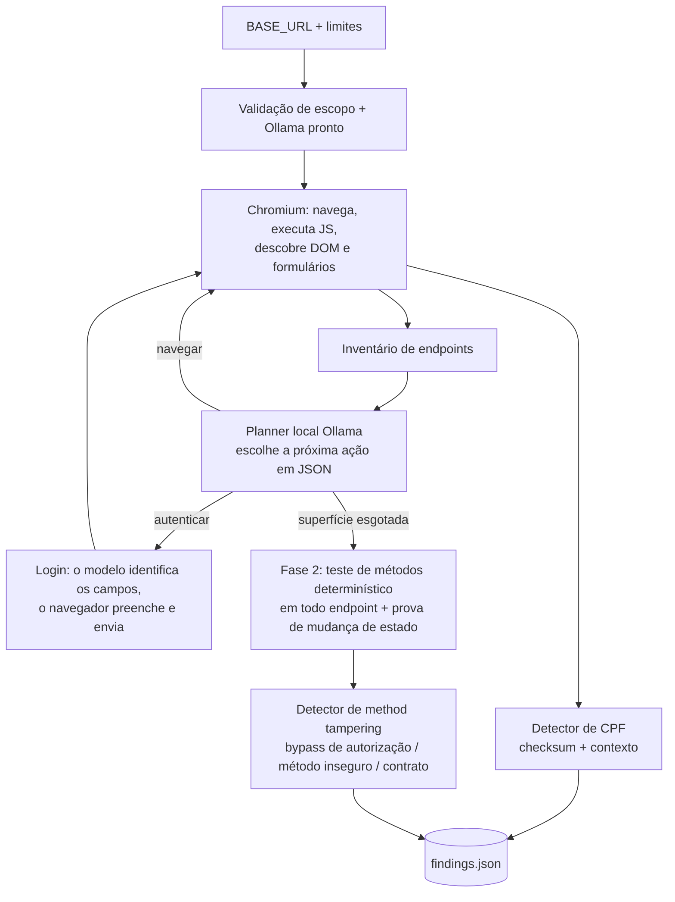

# Local Agentic Security Scanner

Autor: **Matheus Bolela**

Agente de segurança para o desafio de AppSec. Recebe uma aplicação local por `BASE_URL`, descobre sua superfície, faz login quando há credenciais, investiga exposição de CPF e HTTP Method Tampering e grava `findings.json`. Usa exclusivamente um modelo local via Ollama; não contém rotas nem credenciais específicas do alvo.

## Tecnologias

- **Python 3.10+** — agente, transporte HTTP e detectores (só biblioteca padrão no núcleo).
- **Ollama** com **`qwen2.5:7b`** — modelo local que decide as ações do agente (navegar, logar). Nenhum serviço de IA externo.
- **Playwright + Chromium** (headless) — navegação real, execução de JavaScript e descoberta de formulários.
- **jsonschema** — validação do `findings.json` contra o schema versionado em [`schemas/findings.schema.json`](schemas/findings.schema.json).

Dependências fixadas em [`requirements.txt`](requirements.txt) (`playwright==1.58.0`, `jsonschema==4.26.0`).

## Preparação

Requisitos: Linux ou macOS (no Windows, WSL2), Bash e [Ollama](https://docs.ollama.com/download). A preparação precisa de internet; o scan em si roda offline.

```bash
./setup.sh              # cria .venv, instala dependências e o Chromium
ollama pull qwen2.5:7b  # baixa o modelo local
```

O `run.sh` cuida do Ollama sozinho: reutiliza uma instância disponível ou inicia uma, e encerra apenas a que ele próprio subiu.

## Execução

Com a aplicação alvo no ar:

```bash
BASE_URL=http://localhost:3000 ./run.sh
```

Quando a aplicação exige login, exporte as duas variáveis (nunca passadas ao modelo, nunca gravadas no relatório):

```bash
export BASE_URL=http://localhost:3000
export CHALLENGE_USERNAME='usuario-do-desafio'
export CHALLENGE_PASSWORD='senha-do-desafio'
./run.sh
```

O `findings.json` é escrito **no diretório de onde o comando foi executado** (use `OUTPUT_FILE=/caminho/findings.json` para fixar o destino). Arquivos `.env` não são carregados automaticamente.

> **Atenção:** os testes de método são **ativos** — enviam `POST/PUT/PATCH/DELETE` e submetem formulários descobertos, o que pode **alterar o estado** do alvo (ex.: efetivar uma ação via método inesperado). Execute contra a instância local **descartável** do desafio.

### Variáveis de ambiente

| Variável | Padrão | Função |
|---|---|---|
| `BASE_URL` | obrigatório | Origem local do alvo (loopback/rede privada apenas) |
| `CHALLENGE_USERNAME`, `CHALLENGE_PASSWORD` | vazios | Credenciais, sempre em par |
| `OUTPUT_FILE` | `findings.json` | Caminho do relatório de saída |
| `OLLAMA_BASE_URL` | `http://127.0.0.1:11434` | Serviço Ollama local |
| `OLLAMA_MODEL` | `qwen2.5:7b` | Modelo local (modelos cloud são rejeitados) |
| `MAX_SECONDS` | `900` | Duração máxima aproximada do scan |
| `MAX_REQUESTS` | `1500` | Limite global de requisições ao alvo |

Demais limites (`MAX_PAGES`, `MAX_ENDPOINTS`, `MAX_LLM_CALLS`, `MAX_LLM_TOKENS`, `REQUEST_TIMEOUT`, `OLLAMA_TIMEOUT`, `MAX_BODY_BYTES`, `BROWSER_SETTLE_MS`) têm padrões seguros e raramente precisam de ajuste.

## Arquitetura



O modelo local é o **planner**: a cada passo ele escolhe a próxima ação (navegar ou autenticar) a partir de IDs válidos, em JSON estruturado, e identifica os campos de login pelos metadados do formulário. O modelo **não inventa** vulnerabilidades — todo achado vem de detectores determinísticos com evidência reproduzível (checksum de CPF, comparação exata de respostas, mudança de estado observada). A exploração é guiada por IA, onde julgamento ajuda; a evidência é mecânica, para não haver falso positivo alucinado. O teste de métodos (Fase 2) roda sem o modelo, por velocidade e reprodutibilidade.

HTML, links e labels são tratados como dados não confiáveis: nunca viram instruções para o modelo. Cookies e tokens de autenticação são reutilizados apenas na mesma origem; as sondagens anônimas usam um contexto sem eles. As credenciais nunca chegam ao modelo nem ao relatório.

### Módulos

| Arquivo | Responsabilidade |
|---|---|
| `scanner/__main__.py` | Ponto de entrada (`python -m scanner`): monta tudo, roda o agente, grava `findings.json` e define o código de saída |
| `scanner/agent.py` | Orquestrador: Fase 1 (loop guiado pelo modelo) e Fase 2 (teste determinístico de métodos e mudança de estado) |
| `scanner/llm.py` | Cliente Ollama: `preflight`, `choose` (próxima ação) e `login_fields`; schema JSON, temperatura 0, orçamentos |
| `scanner/browser.py` | Chromium/Playwright: navegação, execução de JS, descoberta de DOM/formulários e login |
| `scanner/discovery.py` | Inventário de endpoints (HTML, JSON, JS, OpenAPI) e registro de formulários |
| `scanner/detectors.py` | Detectores determinísticos: CPF e method tampering (bypass, método inseguro/CSRF, violação de contrato) |
| `scanner/transport.py` | HTTP controlado: IPs locais fixados, sem proxy, redirects explícitos, orçamentos, limite de corpo |
| `scanner/safety.py` | Validação de escopo (loopback/rede privada), canonicalização de URL e redação de credenciais/CPF |
| `scanner/service.py` | Ciclo de vida do Ollama local (sobe/reutiliza e encerra só o processo próprio) |
| `scanner/config.py` | Leitura e validação das variáveis de ambiente |
| `scanner/ui.py` | Saída estilizada do terminal |
| `schemas/findings.schema.json` | Contrato do relatório de saída |
