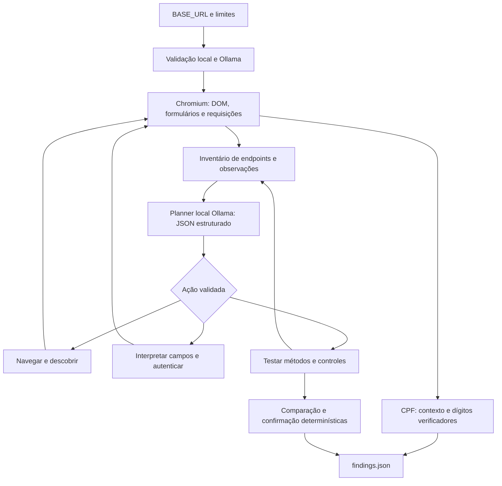

# Local Agentic Security Scanner

Agente de segurança para o desafio de AppSec. Recebe uma aplicação local por `BASE_URL`, descobre sua superfície, realiza login quando há credenciais, investiga exposição de CPF e HTTP Method Tampering e grava `findings.json`. O agente usa exclusivamente um modelo local servido pelo Ollama. Não contém rotas ou credenciais específicas do alvo.

## Preparação

Requisitos: Linux ou macOS, Bash, Python 3.10+, dependências de sistema do Chromium e [Ollama](https://docs.ollama.com/download). Em Windows, utilize WSL2. Os pesos do modelo e o navegador são preparados **antes** da execução; `run.sh` não instala pacotes nem baixa modelos.

```bash
./setup.sh
ollama pull qwen2.5:7b
```

O `run.sh` cuida do serviço Ollama: reutiliza uma instância disponível ou inicia o binário instalado no sistema (ou a cópia portátil em `.runtime/ollama`), desabilita recursos cloud e aguarda a API ficar pronta. Ao terminar ou receber uma interrupção, encerra somente a instância que ele próprio iniciou. Não é necessário executar `scripts/serve-ollama.sh` separadamente; esse script permanece apenas como utilitário opcional. A cópia portátil e os pesos ficam fora do ZIP de fontes.

Se o Chromium informar bibliotecas de sistema ausentes em Linux, instale-as com `.venv/bin/python -m playwright install-deps chromium` (pode exigir privilégios de administrador). Em Ubuntu 26.04, o setup seleciona automaticamente o build de Ubuntu 24.04 validado neste projeto, pois a versão fixada do Playwright ainda não reconhece esse sistema. Não é necessário Docker.

A preparação precisa de acesso aos distribuidores dos pacotes/modelo. O scan funciona sem internet após essa preparação. O ZIP de fontes inclui código, dependências fixadas, scripts, documentação, schema e testes; não inclui Python, pesos de vários GB ou binários específicos de sistema operacional. Para preparar uma máquina sem internet, transfira previamente os pacotes Python, o diretório do Chromium e o modelo Ollama usando uma máquina de mesmo sistema/arquitetura; veja [execução offline](docs/offline.md).

## Execução contra sua aplicação

Com sua aplicação local em execução e as dependências/modelo já preparados, basta:

```bash
BASE_URL=http://localhost:3000 ./run.sh
```

Quando há autenticação, forneça as duas variáveis no ambiente:

```bash
export BASE_URL=http://localhost:3000
export CHALLENGE_USERNAME='usuario-do-desafio'
read -rs -p 'Senha do desafio: ' CHALLENGE_PASSWORD; printf '\n'
export CHALLENGE_PASSWORD
./run.sh
unset CHALLENGE_PASSWORD
```

O arquivo `findings.json` é escrito no diretório de onde o comando foi executado. `OUTPUT_FILE` permite outro destino. Arquivos `.env` não são carregados implicitamente. Credenciais são usadas somente no formulário descoberto e ficam fora dos prompts, logs e evidências persistidas.

Os testes de métodos são **ativos**, enviando requisições vazias `POST`, `PUT`, `PATCH` e `DELETE` aos endpoints descobertos. Mesmo sem corpo, esses métodos podem alterar dados. Execute contra a instância local descartável do desafio. O scanner não tenta reproduzir transações, adivinhar IDs ou executar botões de compra/exclusão; não há garantia de ausência de efeitos colaterais.

O escopo é a origem exata de `BASE_URL` (protocolo, host e porta), incluindo caminhos descobertos. Só são aceitos endereços de loopback, RFC1918 e IPv6 ULA; endereços públicos, link-local/metadata e destinos de outra origem são bloqueados. Use o mesmo hostname em todos os links da aplicação. Um backend em outra porta e um provedor externo de login ficam fora do escopo. Redes privadas são permitidas para aplicações locais em contêineres.

## Arquitetura e comportamento agentic



O Ollama escolhe a próxima ação a partir de IDs válidos de ações disponíveis e identifica os campos de login a partir de metadados do formulário. Cada decisão modifica a exploração, recebe um resultado e alimenta a próxima decisão. A IA não é uma chamada decorativa ao fim do scan, nem recebe corpos HTTP inteiros. O contexto contém inventário resumido, origem das descobertas, orçamento e resultados recentes. A API `/api/chat` usa schema JSON, temperatura zero, saída limitada e até uma repetição em caso de resposta inválida. Não há modo silencioso sem IA: se o Ollama estiver indisponível ou não produzir ações válidas, a execução falha explicitamente.

As ações são fechadas: o modelo não pode inventar URLs, executar comandos ou inserir findings. HTML, links e labels são tratados como dados não confiáveis. As respostas do modelo passam por validação de schema. O transporte e os detectores mantêm os limites e os critérios de evidência independentemente do modelo.

### Descoberta e login

- Links e formulários HTML, DOM renderizado, requisições da aplicação, URLs literais em JavaScript, links JSON e contratos OpenAPI **encontrados** na aplicação alimentam o inventário. Não são tentadas listas conhecidas de endpoints.
- O navegador executa JavaScript. Login por formulário, cookies, campos ocultos/CSRF e fluxos de SPA com token observável em headers são suportados. O valor das credenciais nunca é enviado ao modelo.
- Após o login, a entrada é revisitada e os métodos podem ser reavaliados com a sessão. Cookies e headers de autenticação observados são reutilizados somente na mesma origem. As sondagens anônimas usam um contexto sem esses cookies/headers.
- Uma mudança de sessão, uma resposta de login bem-sucedida e a saída do formulário estabelecem uma sessão. O status `verified` exige também observar um recurso negado anonimamente e acessível com a sessão. Credenciais erradas ou falta de login geram cobertura parcial, sem alegação de sucesso.
- Chromium não resolve hosts de rede diretamente; as requisições passam pelo transporte Python, que conecta exclusivamente aos IPs locais fixados na validação inicial. Redirects de navegação são realizados por novas navegações controladas; redirects de HTTP/fetch são validados a cada salto. Proxies do ambiente não são usados.

### Exposição de CPF

São exigidos 11 dígitos, ambos os dígitos verificadores corretos, exclusão de sequências repetidas e contexto de CPF/documento. Aceitam-se formatos pontuado e numérico. Valores mascarados, números sem contexto e exemplos dentro de JavaScript/CSS não são findings. Respostas de erro são excluídas. Cada URL é deduplicada; o relatório guarda contagem, contexto de acesso e hash da resposta, sem CPF completo.

Um CPF não mascarado numa resposta autenticada é descrito como exposição de identificador, com severidade `medium`; isso **não comprova**, por si só, acesso indevido ou falta de necessidade de negócio. Sem autenticação fornecida pelo scanner, a severidade é `high`. A identificação matemática e contextual tem confiança alta; a autorização de negócio não é inferida.

### HTTP Method Tampering

Um `200`, um header `Allow` ou métodos adicionais aceitos isoladamente não bastam. São feitos baseline anônimo, referência autenticada quando disponível, `OPTIONS`, um método desconhecido de controle e sondagens de métodos alternativos. Um resultado só é reportado quando é reproduzível e:

1. O método alternativo anônimo obtém dados de um recurso cujo `GET` nega acesso (`401/403`), corroborado por CPF válido exposto ou equivalência com a referência autenticada; **ou**
2. Um método fora do contrato descoberto (OpenAPI ou `Allow`) retorna os mesmos dados do baseline, com resposta de controle diferente.

A resposta precisa conter dados utilizáveis; respostas genéricas, erros com status `200`, bodies vazios, redirects e comportamento uniforme para qualquer método são excluídos. A confirmação repete a requisição e compara os dados de forma exata (JSON sem depender da ordem de chaves). São registrados os métodos, statuses, hashes, tamanho e contexto de cada resposta. Respostas variáveis podem causar falsos negativos; a escolha privilegia precisão.

## Relatório e códigos de saída

O schema versionado está em [schemas/findings.schema.json](schemas/findings.schema.json). O relatório contém alvo, status, autenticação, cobertura, uso de IA, decisões, avisos, erros e findings. Cada finding explica o que foi encontrado, onde, evidências, impacto e correção sugerida.

| Saída | Status | Significado |
|---|---|---|
| `0` | `completed` | Ações disponíveis concluídas dentro dos limites; findings podem estar vazios |
| `2` | `partial` | Orçamento, falhas de navegação ou autenticação limitaram a cobertura |
| `1` | `failed` | Configuração, Ollama, navegador ou outro erro fatal |
| `130` | `partial` | Interrupção por sinal, com preservação dos resultados obtidos |

Uma execução vazia ainda escreve JSON válido. Erros de configuração e serviço também produzem relatório, desde que Python e o destino sejam utilizáveis. Escrita atômica com permissão `0600` protege o arquivo. Falha de disco/permissão, encerramento forçado por `SIGKILL` e queda de energia não permitem garantir gravação.

## Configuração e custos

| Variável | Padrão | Função |
|---|---|---|
| `BASE_URL` | obrigatório | Origem local do alvo |
| `CHALLENGE_USERNAME`, `CHALLENGE_PASSWORD` | vazios | Credenciais, sempre em par |
| `OLLAMA_BASE_URL` | `http://127.0.0.1:11434` | Serviço Ollama local |
| `OLLAMA_MODEL` | `qwen2.5:7b` | Modelo já instalado; modelos cloud são rejeitados |
| `OLLAMA_BIN` | detecção automática | Caminho/comando do binário usado se for preciso iniciar o serviço |
| `OLLAMA_START_TIMEOUT` | `30` | Prazo para a API do serviço iniciado responder, em segundos |
| `OUTPUT_FILE` | `findings.json` | Arquivo de saída |
| `MAX_REQUESTS` | `240` | Limite global de requisições ao alvo, incluindo o navegador |
| `MAX_PAGES` | `30` | Navegações de navegador |
| `MAX_ENDPOINTS` | `80` | Entradas no inventário |
| `MAX_LLM_CALLS` | `30` | Chamadas de inferência, incluindo repetições e login |
| `MAX_LLM_TOKENS` | `60000` | Orçamento de tokens com reserva conservadora antes de chamadas |
| `MAX_SECONDS` | `900` | Duração máxima aproximada do scan |
| `REQUEST_TIMEOUT` | `12` | Timeout HTTP por operação, em segundos |
| `OLLAMA_TIMEOUT` | `120` | Timeout de inferência, em segundos |
| `MAX_BODY_BYTES` | `1048576` | Limite de corpo por resposta, inclusive após descompressão |
| `BROWSER_SETTLE_MS` | `500` | Espera por atividade JavaScript após navegações |

O modelo recomendado usa vários GB de RAM. Os custos reais de tokens são reportados pelo Ollama; a reserva prévia usa tamanho do prompt em bytes mais o limite de saída. O orçamento global inclui o tempo de inferência. Chamadas bloqueantes de navegador podem ultrapassar o limite por um timeout já iniciado.

A inicialização automática usa a porta de `OLLAMA_BASE_URL`, aceita somente HTTP em loopback e respeita `OLLAMA_MODELS` quando configurado. Serviços em outra máquina da rede privada ou atrás de HTTPS precisam estar disponíveis previamente. O modelo deve estar instalado antes: o comando de scan não baixa pesos.

## Testes e entrega

```bash
.venv/bin/python -m unittest discover -s tests -v
```

Os testes controlados usam um stub explícito do protocolo Ollama, Chromium real e servidores HTTP locais. O teste de IA real é separado:

```bash
RUN_REAL_OLLAMA=1 .venv/bin/python -m unittest tests.test_real_ollama -v
```

As aplicações de teste usam rotas aleatórias e dados sintéticos. São independentes da aplicação que o avaliador fornecerá. Uma demonstração opcional pode ser iniciada com `python3 -m demo.server`; `--spa` exercita login JavaScript e `--safe` remove as vulnerabilidades deliberadas. As credenciais sintéticas são mostradas no terminal.

Para produzir o entregável:

```bash
python3 scripts/package.py
```

O arquivo `dist/mercadolibre-agent.zip` exclui `.git`, `.env`, relatórios locais, caches e pesos do modelo. O envio por e-mail fica a cargo do candidato. Veja a [matriz de requisitos](docs/requirements.md) e os [resultados de validação](docs/validation.md).

## Limites conhecidos

A exploração é limitada, portanto `completed` não significa ausência de vulnerabilidades. O agente não resolve CAPTCHA/MFA, login externo, fluxos de múltiplas etapas arbitrários, navegação exclusiva por eventos de botões, rotas exclusivas de fragmentos, WebSockets ou parâmetros de caminho desconhecidos. Service workers e recursos fora da origem são bloqueados. Login em iframe e HTTP Basic não são automatizados. Endpoints que só funcionam com bodies específicos, respostas altamente dinâmicas ou dados sem contexto suficiente podem não gerar findings. Certificados HTTPS devem ser confiáveis para Python; é possível fornecer uma CA local via `SSL_CERT_FILE`.

Referências técnicas: [Ollama: chat e schema estruturado](https://docs.ollama.com/api/chat), [Ollama: modelos locais](https://docs.ollama.com/api/tags), [Playwright: interceptação de rede](https://playwright.dev/python/docs/network), [Playwright: Route](https://playwright.dev/python/docs/api/class-route).
